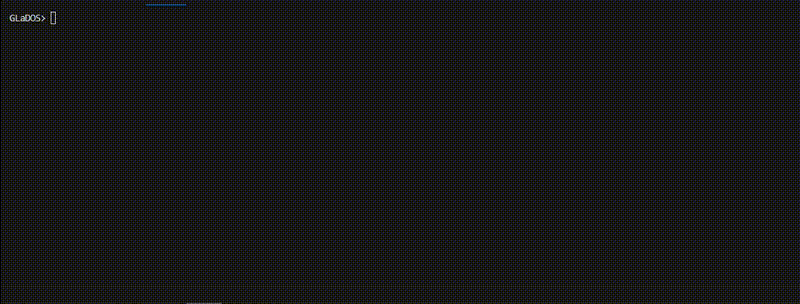

# 🐚 Minishell - A Unix Shell Implementation

<div align="center">



[](https://42.fr)
[](https://en.wikipedia.org/wiki/C_(programming_language))
[]()
[]()

*A feature-complete Unix shell implementation built from scratch in C*

**Authors**: [alavaud](https://github.com/mario8705) & [lgeniaux](https://github.com/lgeniaux)

</div>

---

## 🚀 Overview

**Minishell** is a comprehensive Unix shell implementation developed as a team project for 42 School. This project recreates the core functionality of bash, demonstrating advanced systems programming concepts including process management, signal handling, parsing, and inter-process communication.

Built entirely in **C** with only low-level system calls and the GNU Readline library, Minishell showcases our ability to understand and implement complex shell behaviors from the ground up.

### 🎯 Key Achievements

- **Complete Shell Environment**: Full-featured interactive shell with command history
- **Advanced Parsing Engine**: Sophisticated tokenizer handling quotes, pipes, and redirections  
- **Process Management**: Multi-process pipeline execution with proper signal propagation
- **Memory Management**: Zero memory leaks with comprehensive cleanup systems
- **POSIX Compliance**: Standards-compliant implementation of shell behaviors

---

## ⚡ Features

### 🔧 Built-in Commands
- **`cd`** - Directory navigation with relative/absolute paths and `OLDPWD` support
- **`echo`** - Text output with `-n` flag support
- **`env`** - Environment variable display
- **`exit`** - Shell termination with custom exit codes
- **`export`** - Environment variable creation and modification
- **`pwd`** - Current working directory display
- **`unset`** - Environment variable removal

### 🔀 Shell Operations
- **Command Execution**: Support for absolute paths, relative paths, and `$PATH` lookup
- **Pipeline Processing**: Multi-command pipes (`cmd1 | cmd2 | cmd3`)
- **I/O Redirection**: 
  - Output redirection (`>`, `>>`)
  - Input redirection (`<`)
  - Here-documents (`<<`) with delimiter processing
- **Quote Processing**: Single and double quote handling with proper escaping
- **Variable Expansion**: Environment variables (`$HOME`, `$USER`) and exit codes (`$?`)

### 🎛️ Interactive Features
- **Readline Integration**: Command-line editing with history navigation
- **Signal Handling**: Proper `Ctrl+C`, `Ctrl+D`, and `Ctrl+\` behavior
- **Custom Prompt**: "GLaDOS>" prompt (Portal reference!)
- **TTY Detection**: Automatic behavior adjustment for interactive vs. non-interactive mode

---

## 🏗️ Architecture

### Core Components

```
┌─────────────────┐    ┌──────────────────┐    ┌─────────────────┐
│   Tokenizer     │───▶│   Parser         │───▶│   Executor      │
│ • Quote handling│    │ • Command groups │    │ • Process mgmt  │
│ • Operators     │    │ • Redirections   │    │ • Pipeline exec │
│ • Variables     │    │ • Pipe sequences │    │ • Signal prop   │
└─────────────────┘    └──────────────────┘    └─────────────────┘
         │                       │                       │
         ▼                       ▼                       ▼
┌─────────────────┐    ┌──────────────────┐    ┌─────────────────┐
│ Lexical Analysis│    │ Syntax Analysis  │    │ Runtime Exec    │
│ • Token streams │    │ • AST building   │    │ • Fork/exec     │
│ • Error handling│    │ • Heredoc prep   │    │ • Wait/status   │
└─────────────────┘    └──────────────────┘    └─────────────────┘
```

### Data Structures

**Core Shell State** (`t_msh`)
```c
typedef struct s_msh {
    char        pwd[MAXPATHLEN];    // Current working directory
    const char  *arg0;              // Shell name
    char        **env;              // Environment variables
    int         last_code;          // Last command exit status
    int         should_exit;        // Exit flag
    int         exit_code;          // Shell exit code
    t_pipeline  *pipeline;          // Current executing pipeline
} t_msh;
```

**Command Pipeline** (`t_pipeline`)
- Linked list of commands connected by pipes
- Environment variable resolution
- Process ID tracking for signal management
- Built-in command detection and execution

**Token Processing** (`t_token`)
- Type classification (TEXT, PIPE, REDIR_IN/OUT, HEREDOC)
- Length-bounded string processing
- Quote-aware tokenization

### Execution Flow

1. **Input Processing**: Readline captures user input with history support
2. **Lexical Analysis**: Tokenizer breaks input into semantic tokens
3. **Parsing**: Command groups and redirections are identified and structured
4. **Variable Resolution**: Environment variables and special parameters expanded
5. **Heredoc Processing**: Here-documents processed and temporary files created
6. **Pipeline Execution**: Commands executed in child processes with proper pipe setup
7. **Signal Management**: Parent process manages child signals and terminal control
8. **Cleanup**: Memory freed, file descriptors closed, temporary files removed

---

## 🛠️ Technical Implementation

### Memory Management
- **Custom Memory Functions**: Implementation of `ft_calloc`, `ft_strdup`, etc.
- **Leak Prevention**: Comprehensive cleanup in all execution paths
- **String Management**: Safe string operations with bounds checking

### Process Management  
- **Fork/Exec Model**: Proper child process creation and management
- **Pipeline Setup**: Inter-process communication via pipes
- **Signal Propagation**: Signals correctly forwarded to child processes
- **Exit Status Handling**: Proper collection and reporting of child exit statuses

### Signal Handling
```c
// Interactive mode: Ctrl+C resets prompt
void interactive_sig_handler(int sig) {
    printf("\n");
    rl_on_new_line();
    rl_replace_line("", 0);
    rl_redisplay();
}

// Execution mode: Signals propagated to pipeline
void exec_sig_handler(int sig) {
    if (sig == SIGQUIT && g_minishell.pipeline)
        pipeline_propagate_signal(g_minishell.pipeline, SIGQUIT);
}
```

### Environment Management
- **SHLVL Tracking**: Proper shell nesting level management
- **PATH Resolution**: Command lookup in PATH directories
- **PWD/OLDPWD**: Working directory state maintenance
- **Variable Export**: Environment variable inheritance to child processes

---

## 📊 Project Metrics

| Metric | Value |
|--------|-------|
| **Lines of Code** | 3,244 |
| **Source Files** | 47 C files |
| **Header Files** | 1 comprehensive header |
| **Built-in Commands** | 7 complete implementations |
| **Memory Leaks** | 0 (Valgrind validated) |

---

## 🔧 Build & Usage

### Prerequisites
- GCC compiler with C99 support
- GNU Readline library (`libreadline-dev`)
- Termcap library (`libtermcap-dev`)
- Make utility

### Compilation
```bash
# Clone the repository
git clone https://github.com/lgeniaux/minishell.git
cd minishell

# Build the project
make

# Run the shell
./minishell
```

### Example Usage
```bash
GLaDOS> echo "Welcome to Minishell!"
Welcome to Minishell!

GLaDOS> export GREETING="Hello World"
GLaDOS> echo $GREETING | wc -w
2

GLaDOS> ls | grep .c | head -5
GLaDOS> cd srcs && pwd && cd .. && echo "Back to: $PWD"

GLaDOS> cat << EOF > test.txt
> This is a heredoc
> Multiple lines supported
> EOF

GLaDOS> exit 42
```

---

## 🎓 Educational Value

This project demonstrates mastery of:

### Systems Programming
- **Low-level I/O**: File descriptor management and redirection
- **Process Control**: Fork, exec, wait system calls
- **Signal Handling**: Asynchronous event management
- **Memory Management**: Manual allocation and deallocation

### Software Engineering
- **Modular Design**: Clean separation of parsing, execution, and I/O
- **Error Handling**: Robust error recovery and user feedback
- **Testing Strategy**: Comprehensive validation against bash behavior
- **Collaborative Development**: Git workflow with multiple contributors

### Computer Science Concepts
- **Lexical Analysis**: Tokenization and parsing theory
- **Process Communication**: Inter-process communication via pipes
- **State Machines**: Shell state management and mode transitions
- **System Interface**: Understanding Unix system call interface

---

## 📝 License

This project is part of the 42 School curriculum. Code is provided for educational purposes.
